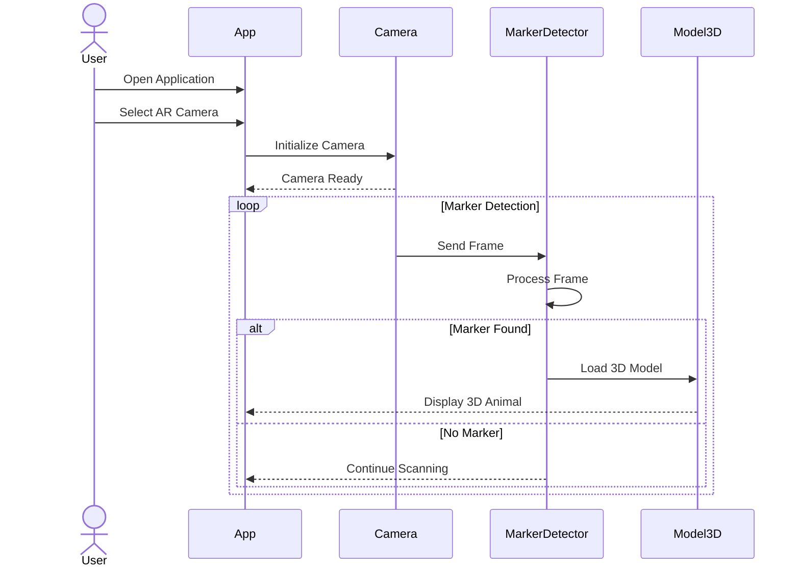

# Sequence Diagram

```mermaid
sequenceDiagram
    actor User
    participant App
    participant Camera
    participant MarkerDetector
    participant Model3D

    User->>App: Open Application
    User->>App: Select AR Camera
    App->>Camera: Initialize Camera
    Camera-->>App: Camera Ready

    loop Marker Detection
        Camera->>MarkerDetector: Send Frame
        MarkerDetector->>MarkerDetector: Process Frame
        alt Marker Found
            MarkerDetector->>Model3D: Load 3D Model
            Model3D-->>App: Display 3D Animal
        else No Marker
            MarkerDetector-->>App: Continue Scanning
        end
    end
```
